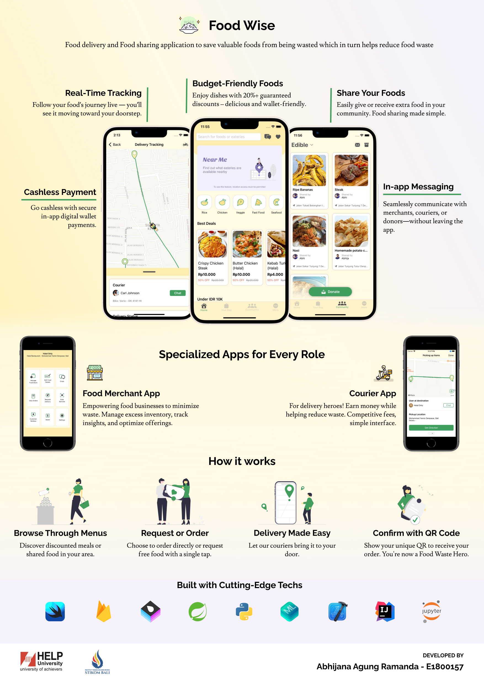

# Food Wise

Food Wise is an iOS application focused on reducing food waste by connecting people with surplus food to those who can benefit from it—before it goes to waste. The platform enables users to purchase food nearing its expiration date or with minor imperfections, still safe and suitable for consumption, at discounted prices from local merchants and retailers.

In addition to buying food, users can also share excess or compostable food within their community to minimize household waste. The app supports three types of users:

- Customers, who browse, order, or request shared food;

- Merchants, such as local eateries and supermarkets offering surplus food at reduced prices to avoid losses;

- Couriers, who deliver food directly to customers’ doorsteps or facilitate pickups.

By bridging the gap between surplus and need, Food Wise offers a practical, community-driven solution to food waste.

> 📽️ **Want to see the prototype?**  
>  [Check out the demo slides →](https://docs.google.com/presentation/d/1wAH6dSp7TSnl3x-e6xX-Gk9soTEU4APX/edit?usp=drive_link&ouid=116749715032397826115&rtpof=true&sd=true)

> ⚠️ **Note:** The code was last updated in **May 2022**. It is not production-ready and should be considered at **hackathon-level quality**. Use it for educational or inspiration purposes only.

> 💡 This project was built in the pre-AI coding assistant era—it reflects the hands-on grind of solo development.

## 🖼️ Project Infographic

## 🚀 Key Features

- **💸 Budget-Friendly Meals**  
  Every item listed offers a minimum **20% discount**, helping users access affordable food options.

- **🤝 Food Sharing**  
  Easily share or receive surplus food within your neighborhood. A simple way to reduce waste and help others.

- **📱 Dedicated Apps for Every Role**

  - **Food Merchant App:** For restaurants and food businesses to manage surplus stock and reduce waste.
  - **Courier App:** For couriers to pick up and deliver food at competitive service rates.

- **🧾 QR-Based Verification**  
  Orders are verified via a scannable QR code at the point of pickup or delivery.

- **🔍 Real-Time Tracking**  
  Track your food's live location—from supermarkets, food stalls, or neighbors—all the way to your doorstep.

- **💬 In-App Messaging**  
  Communicate directly with merchants, couriers, or food donors—without leaving the app.

- **💳 Cashless Payment**  
  Pay seamlessly using the in-app wallet, with easy top-ups via credit card.

## 🧰 Tech Stack

Food Wise is built using modern development tools and technologies, including:

- **Frontend:** SwiftUI, UIKit
- **Backend:** Firebase (Authentication, Firestore, Storage), Vapor (SMTP Service), Spring boot (Square Payment Gateway Integration)
- **Maps & Navigation:** MapKit
- **State Management:** Combine
- **ML**: CoreML, Python (data cleaning)

## 📚 Resources

Below are additional materials related to this project:

- Prototype Demonstration & Slide Deck: [BIT305 E1800157 Final Presentation Slides](https://docs.google.com/presentation/d/1wAH6dSp7TSnl3x-e6xX-Gk9soTEU4APX/edit?usp=drive_link&ouid=116749715032397826115&rtpof=true&sd=true)
- Final Year Project Report / Journal: [Jurnal 180031251 Abhijana Agung Ramanda](https://docs.google.com/document/d/1yE8bauGhzYIFLBvWZf5e6kCZGJeFV8vD/edit?usp=sharing&ouid=116749715032397826115&rtpof=true&sd=true)

---

**Developed by:**  
Abhijana Agung Ramanda  
HELP University & STIKOM Bali  
Student ID: E1800157
